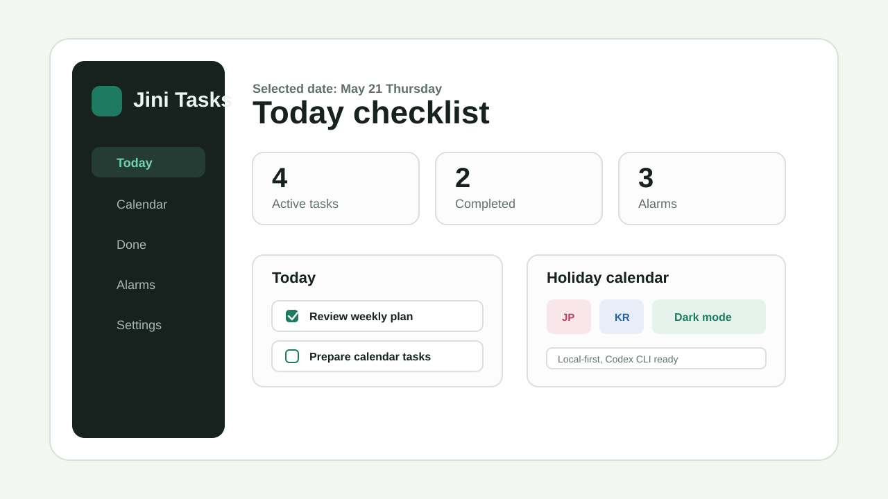

# Jini Tasks



Jini Tasks는 오늘 해야 할 일, 완료한 일, 캘린더 일정, 알람을 한 곳에서 관리하는 로컬 우선 todo 애플리케이션입니다. 일본 공휴일을 기본 캘린더 기준으로 사용하고, 필요할 때 대한민국 공휴일을 오버레이로 함께 볼 수 있습니다.

## 개요

이 프로젝트는 개인 데스크톱 환경에서 빠르게 할 일을 등록하고 확인하기 위한 React 기반 웹 앱입니다. 브라우저에서는 `localStorage`에 데이터를 저장하며, 로컬 개발 서버에서는 Codex/CLI가 `data/tasks.json`에 태스크를 추가하면 앱과 동기화됩니다.

## 주요 특징

- 오늘 할 일을 체크리스트로 표시하고 체크하면 완료 처리
- 완료한 일과 활성 할 일을 분리해서 확인
- 태스크별 알람 시간과 반복 설정 지원
- 캘린더에서 날짜를 선택해 바로 일정 등록
- 일본 공휴일 기본 표시, 대한민국 공휴일 오버레이 토글
- 라이트/다크/시스템 테마 설정
- Codex 또는 CLI에서 태스크 추가 가능
- PWA manifest와 service worker 포함
- Windows 시작 프로그램 등록/해제 스크립트 제공
- GitHub Actions를 통한 Vercel 자동 배포 workflow 포함

## 기술 스택

- React 19
- TypeScript
- Vite
- Vitest
- Testing Library
- Lucide React
- Browser Notification API
- GitHub Actions
- Vercel CLI

## 실행 방법

### 1. 의존성 설치

```bash
npm install
```

### 2. 개발 서버 실행

```bash
npm run dev
```

기본 실행 주소는 다음과 같습니다.

```text
http://127.0.0.1:5173/
```

다른 포트를 쓰고 싶다면 Vite 인자를 넘기면 됩니다.

```bash
npm run dev -- --host 127.0.0.1 --port 5180 --strictPort
```

### 3. 테스트

```bash
npm test
```

### 4. 프로덕션 빌드

```bash
npm run build
```

### 5. 빌드 결과 미리보기

```bash
npm run preview
```

## Codex/CLI로 태스크 추가

로컬 개발 환경에서는 CLI로 `data/tasks.json`에 태스크를 추가할 수 있습니다.

```bash
npm run task:add -- --title "주간 회고 작성" --date today --time 18:00 --repeat once
```

반복 알람 예시:

```bash
npm run task:add -- --title "매일 정리" --date today --time 21:00 --repeat daily
```

지원하는 반복 값:

- `once`
- `daily`
- `weekdays`
- `weekly`
- `monthly`
- `until-completed`

## 데이터 저장 방식

브라우저 앱은 기본적으로 `localStorage`에 데이터를 저장합니다. 따라서 같은 브라우저에서는 새로고침하거나 재배포 후 다시 접속해도 사이트 데이터가 남아 있는 한 일정이 유지됩니다.

로컬 개발 서버에서는 `/api/app-data` Vite middleware가 `data/tasks.json`을 읽고 쓰며, CLI로 추가한 태스크가 브라우저 앱에 동기화됩니다. Vercel 같은 정적 배포 환경에서는 이 개발 서버 API가 동작하지 않으므로 브라우저 `localStorage`만 사용합니다.

기기 간 동기화나 계정 기반 영구 저장이 필요하면 Supabase, Firebase, Neon 같은 외부 데이터베이스를 추가해야 합니다.

## Windows 시작 프로그램

앱을 Windows 로그인 후 자동 실행하려면 다음 명령을 사용합니다.

```bash
npm run startup:enable
```

자동 실행을 해제하려면 다음 명령을 사용합니다.

```bash
npm run startup:disable
```

이 스크립트는 Windows Startup 폴더에 `Jini Tasks.lnk` 바로가기를 만들거나 제거합니다.

## Vercel 자동 배포

`.github/workflows/vercel.yml`은 `main` 또는 `master` 브랜치에 변경사항이 push되면 테스트와 빌드를 실행한 뒤 Vercel에 production 배포합니다.

GitHub 저장소의 Actions secrets에 다음 값을 등록해야 합니다.

- `VERCEL_TOKEN`
- `VERCEL_ORG_ID`
- `VERCEL_PROJECT_ID`

workflow 단계:

1. Checkout
2. Node.js 설정
3. `npm ci`
4. `npm test`
5. `npm run build`
6. `vercel pull`
7. `vercel build --prod`
8. `vercel deploy --prebuilt --prod`

## 프로젝트 구조

```text
.
├── data/
│   └── tasks.json
├── docs/
│   └── assets/
│       └── thumbnail.svg
├── public/
│   ├── manifest.webmanifest
│   └── sw.js
├── scripts/
│   ├── task-cli.mjs
│   ├── enable-startup.ps1
│   └── disable-startup.ps1
├── src/
│   ├── alarms/
│   ├── components/
│   ├── domain/
│   ├── storage/
│   ├── App.tsx
│   ├── main.tsx
│   └── styles.css
├── .github/
│   └── workflows/
│       └── vercel.yml
├── package.json
└── vite.config.ts
```

## 개발 메모

- 공휴일 데이터는 현재 2026년 기준으로 번들되어 있습니다.
- 알림은 브라우저 권한과 service worker 지원 여부에 따라 동작합니다.
- Vercel 배포본에서는 로컬 CLI 동기화가 아니라 브라우저 저장소를 사용합니다.
